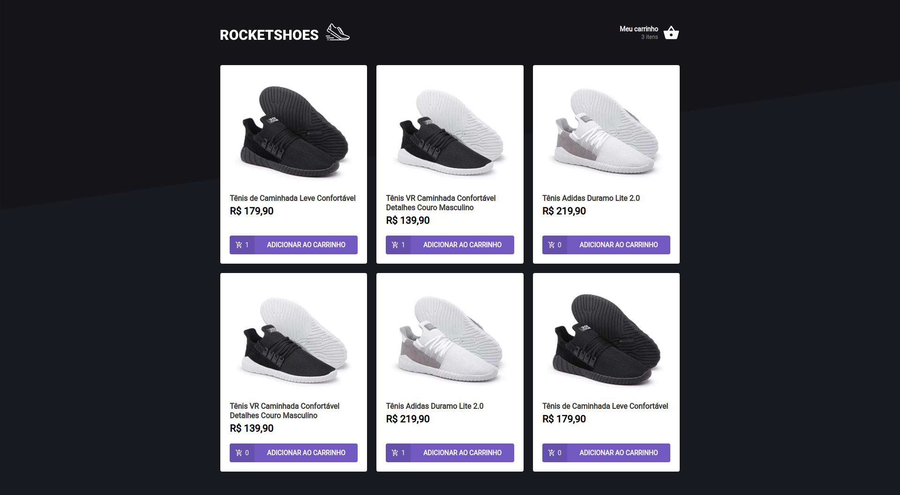
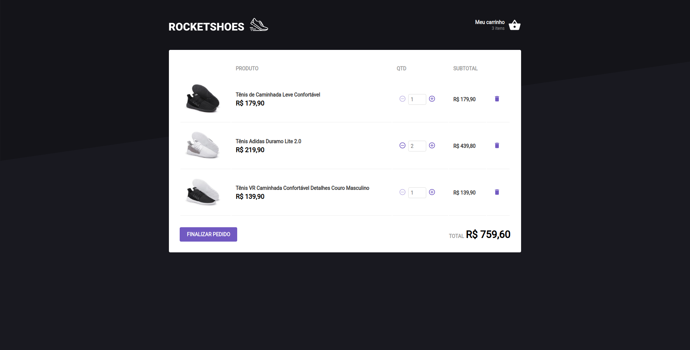

<p align="center">
  <a></a>
</p>

This is the second challenge of the Rocketseat Ignite course.

In this challenge, we had to develop the following tasks:

- Create an useCart hook to control products from a cart
 - add new product
 - remove product from cart
 - increase quantity, sub-total and total
 - decrease quantity, sub-total and total

<p align="center">
  <a></a>
</p>

<p align="center">
  <a></a>
</p>

## 🛠️ Stack

- React
- Typescript
- json-server
- Context API
- Custom hooks

## Run

```
    yarn install
    yarn dev
```

## Run tests

```
    yarn test
```

## :woman: Author

[@laisfrigerio](https://github.com/laisfrigerio/)

## 📄 License

This project is licensed under the MIT License - see the LICENSE file for details